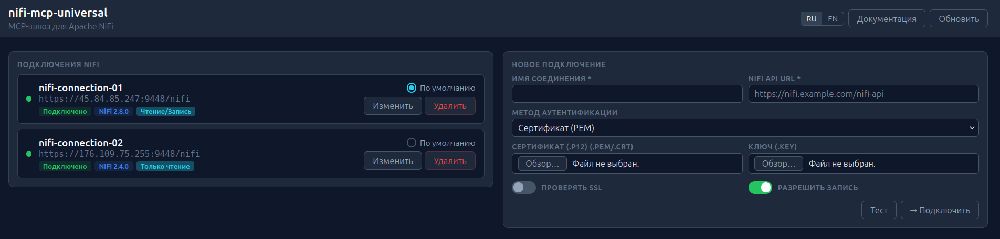

# nifi-mcp-universal

MCP-шлюз для Apache NiFi. Публикует один streamable HTTP endpoint `http://localhost:8085/mcp`, даёт dashboard для управления подключениями и позволяет работать с несколькими NiFi-инстансами одновременно.

Текущий релиз репозитория: `v1.0.0` от `2026-04-16`.



## Что делает проект

- даёт один HTTP MCP endpoint вместо ручной настройки каждого клиента;
- поддерживает несколько подключений к NiFi и per-session routing;
- включает `66` MCP tools для подключения, чтения, диагностики и write-операций;
- поднимает dashboard на `http://localhost:8085/dashboard`;
- поддерживает `7` методов аутентификации: `certificate_p12`, `certificate_pem`, `knox_token`, `knox_cookie`, `knox_passcode`, `basic`, `none`;
- по умолчанию работает в `readonly=true`;
- хранит состояние подключений в Docker volume;
- содержит runbook-файлы:
  - `CODEX.md` для Codex;
  - `AGENTS.md` для любого другого MCP-клиента.

## Требования

| Компонент | Минимум | Обязателен |
|-----------|---------|------------|
| Docker Engine / Docker Desktop | 24+ | да |
| Docker Compose | v2 plugin (`docker compose`) | да |
| Bash | Linux/macOS или Git Bash/WSL | для `setup.sh` |
| PowerShell 5.1+ | Windows | для `install.ps1` |
| Codex CLI | любой актуальный | нет, только для авто-регистрации в Codex |

Важно: поддерживается `docker compose` v2, а не legacy `docker-compose`.

## Быстрый старт

### Linux / macOS

```bash
git clone https://github.com/AlekseiSeleznev/nifi-mcp-universal.git
cd nifi-mcp-universal
./setup.sh
```

### Windows

Нативный путь через PowerShell:

```powershell
git clone https://github.com/AlekseiSeleznev/nifi-mcp-universal.git
cd nifi-mcp-universal
.\install.ps1
```

Альтернативно можно использовать `./setup.sh` из Git Bash или WSL.

## Что делает установка

`setup.sh` и `install.ps1`:

1. проверяют `docker` и `docker compose`;
2. создают `.env` из `.env.example`, если файла ещё нет;
3. не затирают существующий `NIFI_MCP_API_KEY`;
4. поднимают gateway через Docker Compose;
5. ждут готовности `/health`;
6. на Linux пытаются установить `systemd` unit `nifi-mcp-universal`;
7. на Windows пытаются включить автозапуск Docker Desktop;
8. если найден `codex`, пытаются зарегистрировать `nifi-universal` в Codex;
9. устанавливают bundled Codex skill `nifi-flow-layout` в `~/.codex/skills`;
10. если `codex` отсутствует, установка всё равно завершается успешно.

Если в `.env` включён `NIFI_MCP_API_KEY`, а `NIFI_MCP_API_KEY` не экспортирован в shell, gateway всё равно будет установлен, но автоматическая Codex-регистрация будет пропущена. Ручной authenticated-flow описан в [CODEX.md](CODEX.md).

## Bundled Codex skill: `nifi-flow-layout`

Репозиторий включает универсальный Codex skill для красивой раскладки любых Apache NiFi flows:

```text
skills/nifi-flow-layout
```

При `./setup.sh` или `.\install.ps1` skill устанавливается в:

```text
~/.codex/skills/nifi-flow-layout
```

Ручная установка одной командой:

```bash
./tools/install-codex-skills.sh
python3 ~/.codex/skills/nifi-flow-layout/scripts/nifi_layout.py --mode self-test
```

Windows PowerShell:

```powershell
.\tools\install-codex-skills.ps1
python ~/.codex/skills/nifi-flow-layout/scripts/nifi_layout.py --mode self-test
```

Skill не содержит NiFi URL, сертификатов, токенов или customer-specific настроек. Все параметры передаются явно при запуске. Поддерживаются режимы `audit`, `dry-run`, `apply`; перед `apply` сохраняется backup flow JSON. Подробные правила, safety model и примеры audit/dry-run/apply/screenshot см. в [docs/nifi-flow-layout.md](docs/nifi-flow-layout.md). Текущая bundled-версия включает строгие visual gates: 12px clearance от labels/components, 32px между параллельными линиями, запрет X/T пересечений и проверку non-adjacent сегментов одной connection.

## После установки

Проверьте, что gateway поднялся:

```bash
curl http://localhost:8085/health
curl http://localhost:8085/dashboard
```

Ожидаемый результат:

- `/health` отвечает `200`;
- `/dashboard` отвечает `200`;
- `http://localhost:8085/mcp` доступен для MCP-клиента.

### Codex

Если `codex` был доступен во время установки, проверьте:

```bash
codex mcp get nifi-universal --json
```

Если Codex не был установлен или регистрация была пропущена, используйте [CODEX.md](CODEX.md).

### Любой другой MCP-клиент

Используйте [AGENTS.md](AGENTS.md). Нужен streamable HTTP transport с URL:

```text
http://localhost:8085/mcp
```

## Установка без авто-регистрации

Если вам нужен только gateway, достаточно:

```bash
cp .env.example .env
docker compose up -d --build
```

На Windows:

```powershell
docker compose -f docker-compose.yml -f docker-compose.windows.yml up -d --build
```

## Добавление первого подключения к NiFi

Через dashboard:

1. откройте `http://localhost:8085/dashboard`;
2. нажмите «Добавить подключение»;
3. укажите имя, URL и метод аутентификации;
4. для безопасного старта оставьте `readonly=true`.

Через MCP tools:

- `connect_nifi`
- `list_nifi_connections`
- `switch_nifi`
- `test_nifi_connection`

## Linux и Windows: что важно знать

### Linux

- используется host networking;
- `setup.sh` устанавливает и сразу запускает `systemd` unit `nifi-mcp-universal`;
- unit вызывает `docker compose up -d --remove-orphans`, а сам initial install по-прежнему делает `docker compose up -d --build --remove-orphans`;
- после reboot стек возвращается через Docker `restart: always`, а `systemd` даёт штатное управление через `systemctl`;
- ожидаемый статус `systemctl status nifi-mcp-universal` после успешного запуска: `active (exited)`, потому что это `oneshot` wrapper вокруг Docker Compose, а runtime живёт в контейнере.

### Windows

- штатный путь: `install.ps1`;
- runtime использует `docker-compose.windows.yml` с bridge mode и пробросом порта;
- `tools/ensure-docker-autostart-windows.ps1` настраивает автозапуск Docker Desktop только для текущего пользователя;
- PowerShell-install path не требует Git Bash.

## Cleanup, uninstall и переустановка

### Linux / macOS / Git Bash

```bash
./uninstall.sh
```

### Windows

```powershell
.\uninstall.ps1
```

Скрипты удаляют только project-scoped артефакты:

- локальную MCP-регистрацию `nifi-universal`, если доступен `codex`;
- контейнер, volume и local image проекта;
- сгенерированный `docker-compose.override.yml`;
- Linux `systemd` unit `nifi-mcp-universal`;
- Windows log-файл `nifi-mcp-docker-autostart.log`.

Скрипты не удаляют:

- каталог репозитория;
- глобальные настройки Docker Desktop;
- чужие Docker images, volumes, networks и чужие MCP server entries.

После uninstall можно заново поднять проект теми же командами `./setup.sh` или `.\install.ps1`.

## Полный цикл “с нуля”

Linux/macOS:

```bash
./uninstall.sh
cd ..
rm -rf nifi-mcp-universal
git clone https://github.com/AlekseiSeleznev/nifi-mcp-universal.git
cd nifi-mcp-universal
./setup.sh
cd gateway
python3 -m pytest tests/ -v --cov=gateway --cov-branch --cov-report=term-missing --cov-fail-under=100
```

Windows:

```powershell
.\uninstall.ps1
Set-Location ..
Remove-Item -Recurse -Force nifi-mcp-universal
git clone https://github.com/AlekseiSeleznev/nifi-mcp-universal.git
cd nifi-mcp-universal
.\install.ps1
cd gateway
python -m pytest tests/ -v --cov=gateway --cov-branch --cov-report=term-missing --cov-fail-under=100
```

## Конфигурация

Основные переменные:

| Переменная | По умолчанию | Назначение |
|------------|--------------|------------|
| `NIFI_MCP_PORT` | `8085` | порт gateway |
| `NIFI_MCP_LOG_LEVEL` | `INFO` | уровень логирования |
| `NIFI_MCP_API_KEY` | пусто | Bearer auth для `/mcp` и dashboard API |
| `NIFI_MCP_HTTP_TIMEOUT` | `30` | HTTP timeout |
| `NIFI_MCP_SESSION_TIMEOUT` | `28800` | session idle timeout |
| `NIFI_MCP_ENABLE_SIMPLE_TOKEN_ENDPOINT` | `false` | включает `/oauth/token` |
| `NIFI_MCP_PERSIST_SECRETS_IN_STATE` | `false` | сохранять ли секреты в state-файле |

Полный список примеров есть в `.env.example`.

## HTTP endpoints

| Endpoint | Метод | Назначение |
|----------|-------|------------|
| `/mcp` | POST | MCP streamable HTTP transport |
| `/health` | GET | health check |
| `/dashboard` | GET | dashboard |
| `/dashboard/docs` | GET | встроенная документация |
| `/api/status` | GET | статус gateway |
| `/api/connections` | GET | список подключений |
| `/api/connect` | POST | подключить NiFi |
| `/api/disconnect` | POST | отключить NiFi |
| `/api/edit` | POST | изменить подключение |
| `/api/switch` | POST | переключить активное подключение |
| `/api/test` | POST | проверить подключение без сохранения |
| `/.well-known/oauth-protected-resource` | GET | RFC 9728 metadata |
| `/.well-known/oauth-authorization-server` | GET | RFC 8414 metadata |
| `/oauth/token` | POST | compatibility endpoint, по умолчанию выключен |

## Docker и образ

- образ собирается из `gateway/Dockerfile`;
- контейнер запускается от non-root пользователя;
- `EXPOSE 8085` в Dockerfile носит справочный характер;
- фактический runtime port определяется `NIFI_MCP_PORT`.

Публикация Docker package настроена через GitHub Actions и GHCR.

## Тесты

Основной прогон:

```bash
cd gateway
python -m pytest tests/ -v --cov=gateway --cov-branch --cov-report=term-missing --cov-fail-under=100
```

Smoke checks из корня репозитория:

```bash
./tools/ci-smoke.sh
```

Windows smoke checks:

```powershell
.\tools\ci-smoke.ps1
```

Проверка bundled skill:

```bash
./tools/install-codex-skills.sh
python3 ~/.codex/skills/nifi-flow-layout/scripts/nifi_layout.py --mode self-test
```

## Troubleshooting

### Gateway не поднимается

```bash
docker compose logs nifi-mcp-gateway
docker ps
curl http://localhost:8085/health
```

### MCP-клиент не видит сервер

Проверьте:

1. gateway действительно поднят;
2. `/mcp` доступен по нужному порту;
3. если включён `NIFI_MCP_API_KEY`, клиент отправляет Bearer token;
4. на Windows используется bridge config из `docker-compose.windows.yml`.

### Codex не зарегистрировался автоматически

Это больше не считается ошибкой установки. Используйте [CODEX.md](CODEX.md) и выполните регистрацию вручную.

### Codex не видит `nifi-flow-layout`

Переустановите bundled skills и перезапустите/обновите Codex session:

```bash
./tools/install-codex-skills.sh
ls ~/.codex/skills/nifi-flow-layout/SKILL.md
python3 ~/.codex/skills/nifi-flow-layout/scripts/nifi_layout.py --mode self-test
```

### Порт отличается от `8085`

Измените `NIFI_MCP_PORT` в `.env`, затем заново поднимите gateway. Внутренняя документация и примеры по умолчанию показывают `8085`, но runtime использует значение из `.env`.

## Лицензия

[MIT](LICENSE)
